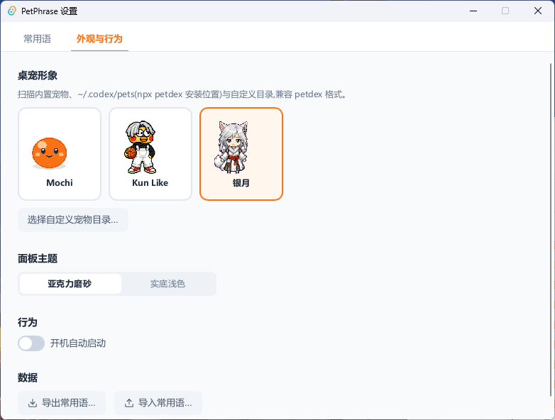
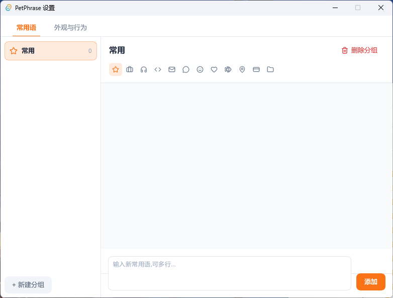

<div align="center">

# 🐾 PetPhrase

**一只桌宠 + 你的常用语面板**

桌宠静坐桌面,点它弹出常用语面板,点一条短语立即复制到剪贴板。<br>
客服回复、报销话术、代码片段——一次点击,不打断手头工作。

[](https://github.com/wangcheng6-ai/PetPhrase/releases/latest)
[](https://github.com/wangcheng6-ai/PetPhrase/releases)
[](https://github.com/wangcheng6-ai/PetPhrase/releases/latest)
[](https://slint.dev/)
[](https://github.com/wangcheng6-ai/PetPhrase/commits/main)
[](LICENSE)
[](https://github.com/wangcheng6-ai/PetPhrase/stargazers)

**单进程原生应用:安装包 5.6MB · 常驻内存 ~23MB · 冷启动 ~0.3s**

</div>

---

## ✨ 它长什么样

| 常用语面板(亚克力磨砂) | 挑选你喜欢的桌宠 |
|:---:|:---:|
|  |  |

<div align="center">

**管理分组与常用语**



</div>

## 🚀 快速上手

1. 从 [Releases](https://github.com/wangcheng6-ai/PetPhrase/releases/latest) 下载 `PetPhrase_x.y.z_x64-setup.exe`,双击安装(装到用户目录,**无需管理员权限**)
2. 桌面右下角出现一只桌宠——**点击它**,弹出常用语面板
3. 点右上角 ⚙ 打开设置,建分组、加常用语(支持多行文本)
4. 之后每次点桌宠 → 点短语 → 已复制 ✓,直接去粘贴

## 🎯 功能

- **桌宠**:透明置顶、雪碧图待机动画,点击招手,可拖拽并记住位置;大小三档可调(小/中/大),缩放时脚位不动
- **常用语面板**:贴宠弹出;分组胶囊 Tab + 全组宫格;短句排成气泡流、长句卡片;搜索跨组过滤;点击复制 + ✓ 反馈 + 自动收起;失焦即隐
- **分组管理**:增删改、长按拖动排序、12 个分组图标
- **主题**:亚克力磨砂 / 实底浅色两种面板主题
- **数据**:开机自启可选;JSON 导入导出;数据原子写入 + 启动备份自动恢复,卸载重装不丢
- **标准安装/卸载**:NSIS 安装包,含 `uninstall.exe` 与「应用和功能」卸载入口,卸载时可选保留数据

## 🐱 换一只喜欢的桌宠

PetPhrase 兼容 [petdex](https://petdex.dev/) 桌宠格式——那个在 X 上火过的 Codex 桌宠生态。去 [petdex.dev](https://petdex.dev/) 逛一圈,挑一只喜欢的,一行命令装好:

```bash
npx petdex@latest install <pet-name>
# 例如:npx petdex@latest install yinyue-2
```

然后打开 PetPhrase 设置 →「外观与行为」,新桌宠已经出现在列表里,点选即换。同页还能调桌宠大小(小/中/大)。

也支持完全自定义:任意目录放上 `pet.json + spritesheet.webp/png`(参考 [petdex 格式](https://github.com/crafter-station/petdex)),在设置里指定该目录即可。

## 📋 使用示例

给客服 / 运营 / 开发同学的分组灵感:

| 分组 | 示例短语 |
|------|---------|
| 💬 客服 | 「您好,感谢您的反馈,我们已经记录了这个问题,会尽快给您答复」 |
| 📧 邮件 | 「收到,马上处理」「好的,没问题」 |
| 💻 代码 | `git rebase -i HEAD~3`、常用正则、SQL 片段 |
| 💳 账号 | 发票抬头、收货地址、公司税号 |

短句(≤10 字)自动排成紧凑气泡流,长文本独占卡片,一眼扫到。

## 🖥️ 平台支持

**目前仅支持 Windows 10/11 x64**,暂无 macOS / Linux 版本。

好消息是:UI 框架 [Slint](https://slint.dev/) 本身跨平台,核心逻辑(存储/布局/动画)与平台无关,移植的主要工作量在窗口特效(亚克力/点击穿透)、托盘、开机自启的平台适配。**欢迎 macOS / Linux 用户提 PR!** 提前开 [Issue](https://github.com/wangcheng6-ai/PetPhrase/issues) 讨论方案更好。

## 🔧 从源码构建

需要 Rust stable 工具链(Windows MSVC)。

```bash
cd app-slint
cargo test                # 21 个单元测试
cargo build --release     # 产出 target/release/PetPhrase.exe
# 打包安装程序(需 NSIS makensis):
makensis installer.nsi    # 产出 target/PetPhrase_0.3.0_x64-setup.exe
```

数据文件位于 `%APPDATA%\PetPhrase\{phrases.json, settings.json}`。

## 🤝 贡献

- 🐛 **报 Bug / 提需求**:[Issues](https://github.com/wangcheng6-ai/PetPhrase/issues) 欢迎任何反馈,中文英文都行
- 🔀 **提 PR**:改动前跑一遍 `cargo test`;涉及 UI 手感的改动建议附截图/录屏
- 🍎🐧 **平台移植**:macOS / Linux 适配是最受欢迎的贡献方向
- ⭐ **觉得好用?** 点个 Star 是最直接的支持

## 🙏 致谢

- 桌宠格式与生态来自 [petdex](https://petdex.dev/)([crafter-station/petdex](https://github.com/crafter-station/petdex))
- UI 框架 [Slint](https://slint.dev/) · 图标 [Lucide](https://lucide.dev/)

## 📄 许可

[MIT](LICENSE) © 2026 wangcheng6-ai
